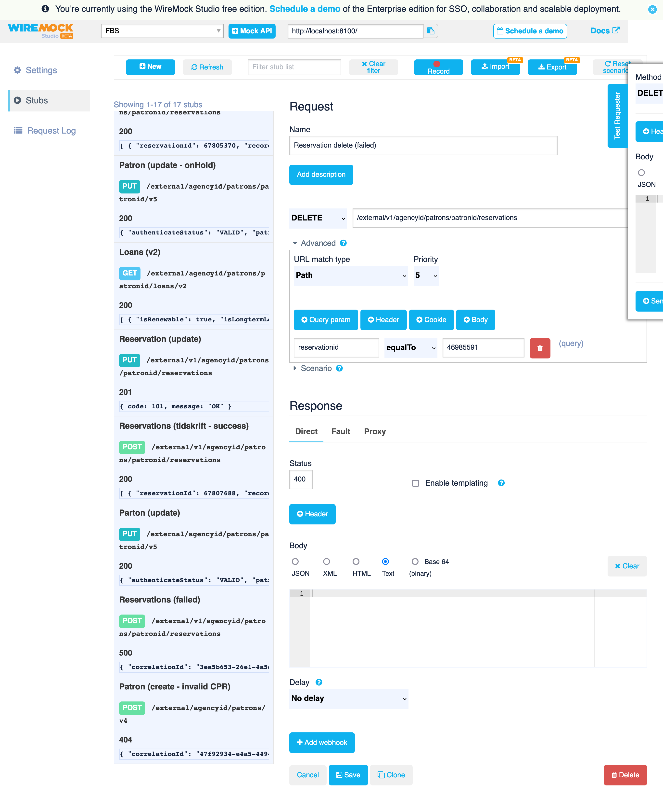

# Request mocking / Wiremock

We use [Wiremock](https://https://wiremock.org/) to enable request mocking and
reduce dependency on external systems during development.

## Background

The React components generally work with data from external systems. Having
data in a specific state may be necessary in the development of some features
but it can be cumbersome so set up exactly such a state. Many factors can also
reduce the usefulness of this state. Development may change it once a
reservation is deleted. Time affects where a loan is current or overdue.

With all this in mind it is useful for us to be able to recreate specific
states. We do so using [Wiremock](https://https://wiremock.org/). Wiremock
is a system which allows us to mock external APIs. It can be configured or
instrumented to return predefined responses given predefined requests.

We use Wiremock through Docker based on the following setup:

1. One Wiremock instance per external API we want to mock
2. [Wiremock Studio](https://wiremock.org/studio/) provides a UI for managing
   Wiremock instances
3. Mocked requests/responses are persisted as files in the repository for
   sharing between developers
4. Wiremock is exposed to local browsers through a Docker DNS proxy like Dory
5. Storybook can be preconfigured to use Wiremock instead of production
   webservices in `.env`

## Howtos

### Use Wiremock instead of production services during development

1. Start Wiremock Docker containers: `docker compose up -d`
2. If available: Enable a Docker DNS proxy like Dory: `dory up`
3. Create/update a `.env` file with hostnames (and ports if necessary) for
   Wiremock Docker containers e.g.:

```dotenv
PUBLIZON_BASEURL=http://publizon-mock.docker`
FBS_BASEURL=http://fbs-mock.docker`
```

<!-- markdownlint-disable-next-line MD029 -->
4. Start Storybook: `yarn run dev`

### Set up a mocked response in Wiremock

To set up a mocked response for a new request to FBS do the following:

1. Open Wiremock Studio at <http://dpl-mock.docker/>
2. Click "FBS" to manage the Wiremock instance for FBS
3. Click "Stubs" to see a list of existing requests/responses
4. Click "New" to create a new request/response set and provide a name
5. Provide the HTTP method, path and other parts of the request to match
6. Provide the response HTTP status code and body to return
7. Click "Save"
8. See that the stub has been persisted as a new file in
   `.docker/wiremock/fbs/mappings`
9. Restart Wiremock docker images to load the updated stub

The following example shows how one might create a mock which returns an error
if the client tries to delete a specific reservation.


